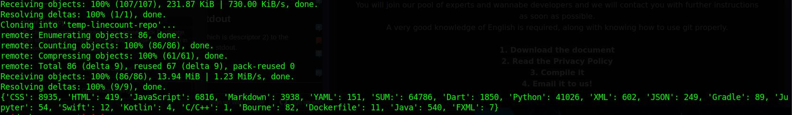

# Bash scripts
## Bash scripts made by me to make things easier
## Line Counter(local)
* Use aliases by ``alias code_count='bash ./words.sh'``
* Use aliases in windows ``doskey code_count='bash words.sh'``
## GitHub-User-line-counter
* It is composed of a bash script and python magic
* Obtaining a list of languages with thier lines of code written
* Demo 1

